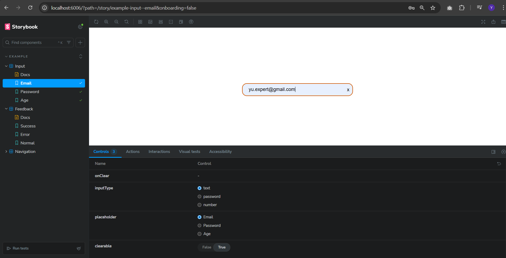
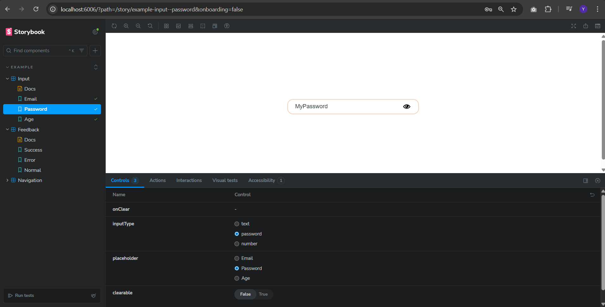
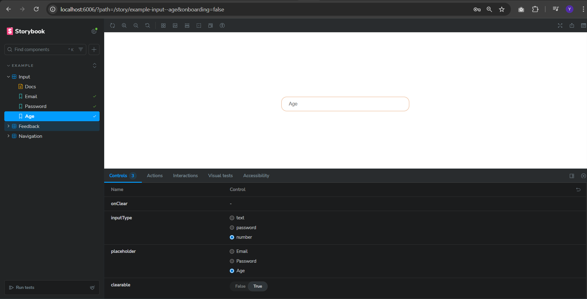
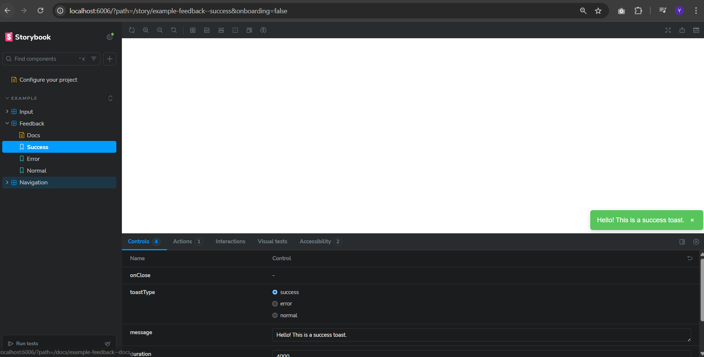
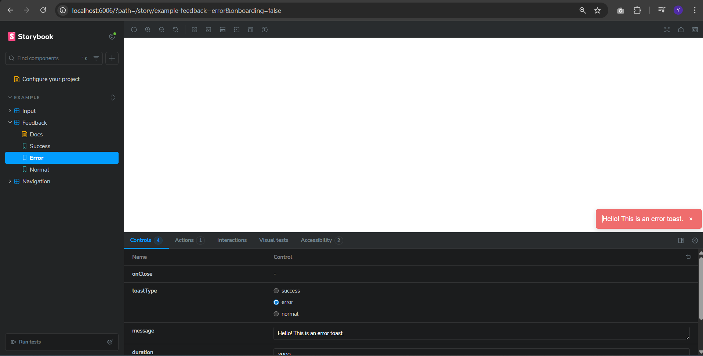
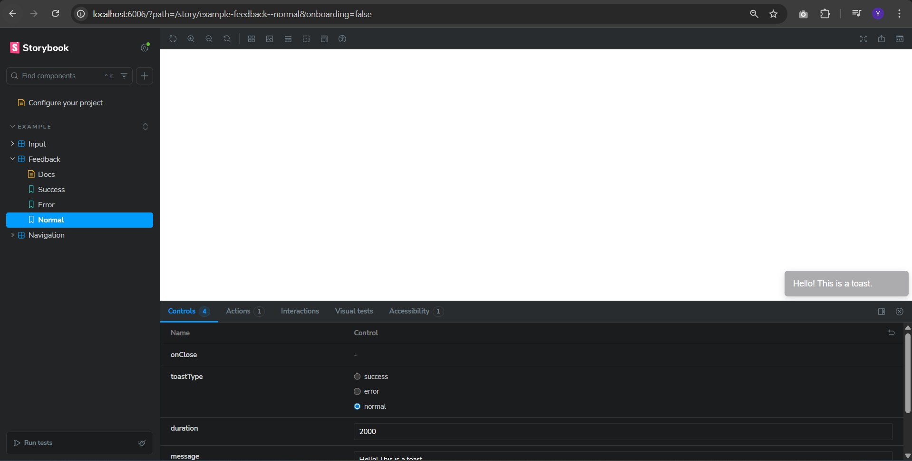
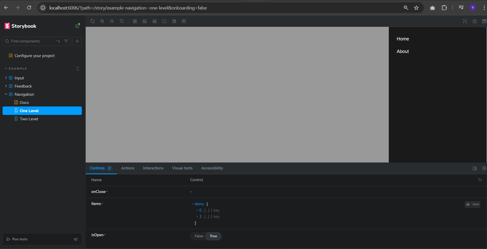
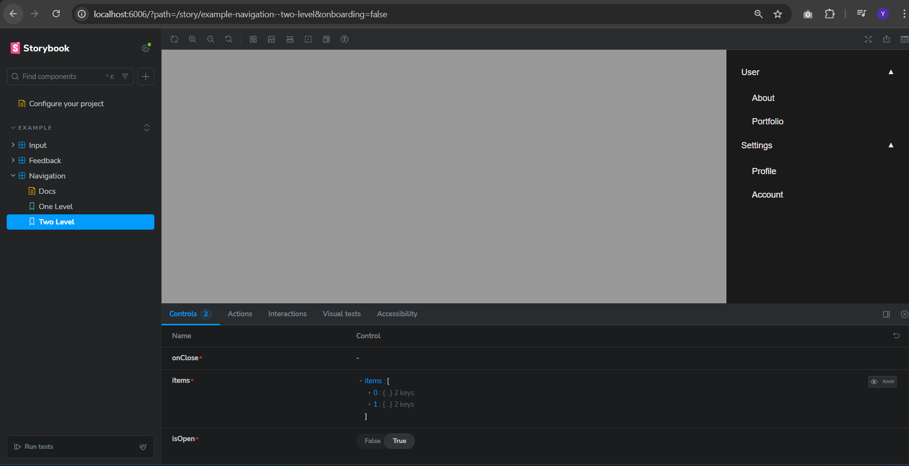

# Front-end JS Engineer Test Assessment – React Component Library

## 🎯 Overview

This repository contains a small **React component library** implemented for a
front-end assessment. The components are **fully reusable**, written in
**TypeScript**, and displayed in **Storybook** with multiple states and
variations.

The project includes:

- A smart `Input` component
- A `Toast` notification component
- A nested `Sidebar Menu` with sliding animation

Screenshots of each component in multiple states are included below.

---

## 🧩 Setup Instructions

1. **Clone the repository**

```bash
https://github.com/yuliia-shl/test-assessment.git
cd test-assessment
```

2. **Install dependencies**

```bash
npm install
# or
yarn install
```

3. **Run Storybook**

```bash
npm run storybook
# or
yarn storybook
```

Open http://localhost:6006 to view all components and their variations.

4. **Run the app locally**

```bash
npm start
# or
yarn start
```

# Component Overview

1. Input Component Props

```ts
interface InputProps {
  inputType: string; // text, password, number
  placeholder: string; // placeholder
  clearable?: boolean; // show clear button
}
```

- Features
  - Supports multiple input types: text, password, number.
  - Password visibility toggle for inputType="password".
  - Optional clear button when clearable is true and input has value.

- Storybook States:
  - **Text**  
    

  - **Password**  
    

  - **Number**  
    

  - Clearable Toggle

2. Toast Component

- Props

```ts
interface ToastProps {
  message: string;
  type?: 'success' | 'error' | 'normal';
  onClose: () => void;
  duration?: number; // in ms
}
```

- Features
  - Appears bottom-right
  - Auto-dismiss after a duration
  - Slide + fade animation
  - Optional manual close button

- Storybook States
  - **Success**  
    

  - **Error**  
    

  - **Normal**  
    

3. Sidebar Menu Component

- Props

```ts
interface SidebarMenuProps {
  items: SidebarItemProps[];
  isOpen: boolean;
  onClose: () => void;
}

interface SidebarItemProps {
  label: string;
  subItems?: SidebarItemProps[];
}
```

- Features
  - Slides in from the right
  - Supports nested items (1-level & 2-level)
  - Closes when clicking the backdrop
  - Smooth open/close animation

- Storybook States:
  - **One-Level**  
    
  - **Two-Levels**  
    

# Development Guidelines

- TypeScript for type safety
- ESLint + Prettier for consistent code style
- Functional components with hooks
- Components fully modular and reusable
